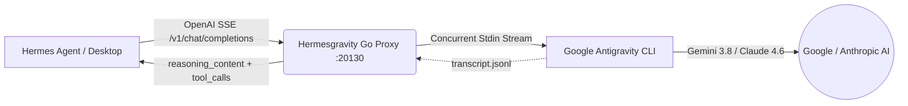

# Hermesgravity ⚡🪐

> **High-performance, ultra-lightweight Go pipe bridging Google Antigravity (`agy` CLI) to Hermes Agent as an OpenAI-compatible provider and MCP subagent server.**

---

## 🚀 Por que Hermesgravity? (The Hard Problems Solved)

Integrar um assistente de terminal/CLI como o Google Antigravity (`agy`) com um agente orquestrador como o **Hermes Agent** traz desafios complexos de arquitetura, especialmente em servidores de poucos recursos (como instâncias gratuitas da Oracle Cloud com 1 vCPU e 1 GB de RAM):

1. **Bypass de `ARG_MAX` (`E2BIG - argument list too long`)**:
   - Proxies comuns disparam o executável com `-p "<prompt>"`. Após algumas rodadas de conversa com retornos de ferramentas (`Ran [...] + 18 commands`), o tamanho dos argumentos excede o limite do kernel Linux (`ARG_MAX`), quebrando a conexão.
   - O **Hermesgravity** transmite todo o histórico e instruções via **STDIN Pipe assíncrono**, suportando prompts gigantescos (testado com mais de 300.000 caracteres) sem limite de tamanho.
2. **Pegada de Memória Ridiculamente Baixa (< 5 MB)**:
   - Substitui implementações pesadas em Python (FastAPI/Uvicorn ~70 MB) por um binário nativo Go estático sem CGO.
   - Consome apenas **~4.9 MB de RAM** e **zero GIL** (Global Interpreter Lock), eliminando travamentos de event loop em processadores de núcleo único.
3. **Extração de Raciocínio (`reasoning_content`)**:
   - Captura pensamentos internos (`<think>...</think>`) e passos de execução (`● Bash(...)`, `● View(...)`, `● Edit(...)`) dos transcripts do Antigravity e os entrega via `delta.reasoning_content`, permitindo visualização de pensamento nativa no Hermes Desktop.
4. **Tradução Bidirecional de Tool Calling**:
   - Mapeia schemas de ferramentas do formato OpenAI (`tools`) para instruções interpretáveis pelo Antigravity, e sanitiza retornos em `<tool_call>`, ````tool_call```` ou sintaxe interna de volta para chamadas de função válidas da especificação OpenAI.
5. **SSE Heartbeat Keep-Alive**:
   - Envia comentários SSE periódicos (`: ping\n\n`) a cada 10 segundos de silêncio do modelo, impedindo que o WebSocket do Hermes Desktop ou gateways de borda encerrem a conexão por timeout prematuro.

---

## 📐 Arquitetura



---

## 📦 Instalação Rápida

### 1. Clonar e Compilar
```bash
git clone https://github.com/jocost4/hermesgravity.git
cd hermesgravity
sudo ./install.sh
```

O script compila o binário estático, instala em `/usr/local/bin/hermesgravity`, cria o serviço systemd com limite de 64MB de memória e inicia o daemon.

---

## ⚙️ Configuração no Hermes Agent

Edite seu arquivo `~/.hermes/config.yaml`:

```yaml
model:
  provider: custom
  default: gemini-3.8-flash-high
  custom_providers:
    antigravity:
      base_url: http://localhost:20130/v1
      api_key: agy-local
```

### Configurar via CLI do Hermes:
```bash
hermes config set model.provider custom
hermes config set model.default gemini-3.8-flash-high
```

---

## 🎯 Modelos Suportados

O Hermesgravity descobre dinamicamente os modelos disponíveis na sua instalação do `agy`:

- `gemini-3.8-flash-high` (Padrão rápido com alto raciocínio)
- `gemini-3.8-flash-low` (Mínima latência)
- `gemini-3.8-pro` (Para tarefas de arquitetura e codificação complexa)
- `claude-sonnet-4-6` (Modelo Anthropic via AGY)
- `claude-opus-4-6-thinking` (Raciocínio estendido)
- `gpt-5-mini`

---

## 🛠️ Endpoints Disponíveis

| Método | Endpoint | Descrição |
| :--- | :--- | :--- |
| `GET` | `/health` | Status do serviço, uptime, rotinas ativas e uso de RAM em MB |
| `GET` | `/metrics` | Métricas Prometheus de requisições e memória |
| `GET` | `/v1/models` | Lista de modelos compatível com OpenAI |
| `GET` | `/v1/models/{id}` | Metadados do modelo |
| `POST` | `/v1/chat/completions` | Streaming (SSE) e Non-Streaming chat completions com tool calling |
| `POST` | `/api/show` | Compatibilidade com Ollama |
| `GET` | `/api/tags` | Compatibilidade com Ollama |

---

## 🛡️ Licença

MIT License. Feito para a comunidade open-source unindo o ecossistema Hermes Agent e Google Antigravity.
