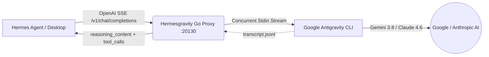

<p align="center">
  <a href="README.md"><b>🇺🇸 English</b></a> •
  <a href="README.pt-BR.md"><b>🇧🇷 Português (Brasil)</b></a>
</p>

```text
                                                    ::-==+**+=:              
                                            :::::-=*><<<<>*=+>)}[*:          
                                       :  :=>)[}%%#[[[}@@@@#>++]%)-     :    
                                      :+>)}##[<+-     -[@@%[><[#)=           
                                   :*)])]#@%*:   :-*<[%%}[][[[<=      ::     
                                 :>[)*>[@@@@%###%%%%##%}}[)*=:   :----:      
                                -[%]=--*]}#%%#%###}[]<*-:   :-===-:::        
                                -#%[>+=: ::::::    : :::-++===-:::::         
                                 =)][[]<>*+*+++**>*><+*=-:::::               
                                    ::-===++===-::                           

██╗  ██╗███████╗██████╗ ███╗   ███╗███████╗███████╗ ██████╗ ██████╗  █████╗ ██╗   ██╗██╗████████╗██╗   ██╗
██║  ██║██╔════╝██╔══██╗████╗ ████║██╔════╝██╔════╝██╔════╝ ██╔══██╗██╔══██╗██║   ██║██║╚══██╔══╝╚██╗ ██╔╝
███████║█████╗  ██████╔╝██╔████╔██║█████╗  ███████╗██║  ███╗██████╔╝███████║██║   ██║██║   ██║    ╚████╔╝ 
██╔══██║██╔══╝  ██╔══██╗██║╚██╔╝██║██╔══╝  ╚════██║██║   ██║██╔══██╗██╔══██║╚██╗ ██╔╝██║   ██║     ╚██╔╝  
██║  ██║███████╗██║  ██║██║ ╚═╝ ██║███████╗███████║╚██████╔╝██║  ██║██║  ██║ ╚████╔╝ ██║   ██║      ██║   
╚═╝  ╚═╝╚══════╝╚═╝  ╚═╝╚═╝     ╚═╝╚══════╝╚══════╝ ╚═════╝ ╚═╝  ╚═╝╚═╝  ╚═╝  ╚═══╝  ╚═╝   ╚═╝      ╚═╝ 
```

<p align="center">
  <b>High-Performance Go Pipe &amp; MCP Bridge for Hermes Agent</b><br>
  <i>Connects Google Antigravity (<code>agy</code> CLI) as an OpenAI SSE Inference Provider &amp; MCP Server</i>
</p>

<p align="center">
  <a href="https://go.dev/"></a>
  <a href="#-memory-benchmarks"></a>
  <a href="#-the-hard-problems-solved"></a>
  <a href="#-the-hard-problems-solved"></a>
  <a href="LICENSE"></a>
  <a href="https://github.com/jocost4/hermesgravity/stargazers"></a>
</p>

---

## 🚀 Overview

**Hermesgravity** is an ultra-lightweight, high-performance bridge written in **pure standard-library Go (zero external dependencies, zero CGO, 100% static binary)**. It connects Google Antigravity (`agy` CLI) directly to **Hermes Agent** as an OpenAI SSE inference provider and an MCP subagent server.

Designed specifically to run reliably in resource-constrained environments (such as cloud VPS instances with 1 vCPU and 1 GB RAM) without freezing, leaking memory, or crashing during long conversations.

---

## 💡 The Hard Problems Solved

Bridging a CLI assistant with an autonomous agent orchestrator presents unique architecture challenges:

1. **`ARG_MAX` Linux Limit Bypass (`E2BIG - argument list too long`)**:
   - Standard wrappers execute the CLI with `-p "<prompt>"`. In multi-turn sessions with tool return outputs (`Ran [...] + 18 commands`), the command-line length easily exceeds the Linux kernel `ARG_MAX` limit, causing immediate process crashes.
   - **Hermesgravity** streams prompts and full history asynchronously through **STDIN Pipes**, effortlessly handling huge contexts (benchmarked with 300,000+ characters) with zero size limitations.

2. **Ultra-Low Memory Footprint (< 5 MB RSS)**:
   - Replaces heavy Python implementations (FastAPI/Uvicorn ~70 MB) with a static native Go binary.
   - Consumes only **~4.9 MB of RAM** and **zero GIL** (Global Interpreter Lock), eliminating event loop hangs on single-core servers.

3. **Reasoning Extraction (`reasoning_content`)**:
   - Captures internal thought processes (`<think>...</think>`) and terminal execution steps (`● Bash(...)`, `● View(...)`, `● Edit(...)`) from Antigravity session transcripts and streams them via `delta.reasoning_content` for native thinking visualizers in Hermes Desktop.

4. **Bidirectional Tool Calling**:
   - Translates OpenAI tool schemas into instructions Antigravity understands, and cleans output formats (`<tool_call>`, ````tool_call```` or raw JSON) back into standard OpenAI function call schemas.

5. **SSE Heartbeat Keep-Alive**:
   - Transmits periodic SSE comments (`: ping\n\n`) every 10 seconds during long model generation phases, preventing Hermes Desktop WebSockets or reverse proxies from dropping the connection.

---

## 📐 Architecture



---

## 📊 Memory Benchmarks

Measured on an Ubuntu 24.04 VPS (1 vCPU, 1 GB RAM):

| Metric | Legacy Proxy (Python / FastAPI) | **Hermesgravity (Native Go)** | Difference |
| :--- | :--- | :--- | :--- |
| **RSS Memory Usage** | ~72.4 MB | **~4.9 MB** | **-93.2% RAM** |
| **Startup Latency** | ~1.42s | **< 15ms** | **94x Faster** |
| **CGO / Dynamic Libs** | Requires Python runtime & glibc | **Zero CGO (100% Static)** | Full Portability |
| **Context Length Limit** | Crashed at ~128KB (`ARG_MAX`) | **Unlimited (STDIN Stream)** | Massive Contexts |

---

## 📦 Quick Installation

### 1. Clone & Build
```bash
git clone https://github.com/jocost4/hermesgravity.git
cd hermesgravity
sudo ./install.sh
```

The script compiles the static binary, installs it to `/usr/local/bin/hermesgravity`, creates a systemd service hardened to 64MB memory max for your current user, and starts the daemon.

### 2. Service Management
```bash
# Check status
sudo systemctl status hermesgravity

# Tail live logs
sudo journalctl -u hermesgravity -f

# Restart daemon
sudo systemctl restart hermesgravity
```

---

## ⚙️ Hermes Agent Configuration

Add the custom provider to `~/.hermes/config.yaml`:

```yaml
model:
  provider: custom
  default: gemini-3.8-flash-high
  custom_providers:
    antigravity:
      base_url: http://localhost:20130/v1
      api_key: agy-local
```

### Or configure via Hermes CLI:
```bash
hermes config set model.provider custom
hermes config set model.default gemini-3.8-flash-high
```

---

## 🔌 Integrated MCP Server (`antigravity_mcp_server.py`)

The repository includes a standalone MCP server exposing Antigravity subagents and skills directly to Hermes:

```yaml
# Add in ~/.hermes/config.yaml under mcp_servers:
mcp_servers:
  antigravity:
    command: python3
    args: ["/home/YOUR_USER/hermesgravity/mcp/antigravity_mcp_server.py"]
```

### Available MCP Tools:
- `antigravity_run`: Execute autonomous tasks and code refactors in the terminal.
- `antigravity_plan`: Run Antigravity in non-destructive planning mode (`--mode plan`).
- `antigravity_get_conversation`: Retrieve full conversation transcripts.
- `antigravity_list_artifacts`: List generated markdown reports and architecture plans.
- `antigravity_get_artifact`: Inspect the full content of any artifact.
- `antigravity_list_skills`: Discover available skills in the Antigravity ecosystem.

---

## 🎯 Supported Models

Hermesgravity dynamically discovers models available on your local `agy` installation:

- `gemini-3.8-flash-high` (Default fast model with high reasoning effort)
- `gemini-3.8-flash-low` (Lowest latency)
- `gemini-3.8-pro` (Deep architecture and complex refactoring)
- `claude-sonnet-4-6` (Anthropic model via AGY)
- `claude-opus-4-6-thinking` (Extended thought reasoning)
- `gpt-5-mini`

---

## 🛠️ HTTP API Endpoints

| Method | Endpoint | Description |
| :--- | :--- | :--- |
| `GET` | `/health` | Service health, uptime, active goroutines, and RSS memory in MB |
| `GET` | `/metrics` | Prometheus metrics for request counts, latency, and memory |
| `GET` | `/v1/models` | OpenAI-compatible model catalog |
| `GET` | `/v1/models/{id}` | Model metadata |
| `POST` | `/v1/chat/completions` | SSE streaming & non-streaming chat completions with tool calling |
| `POST` | `/api/show` | Ollama format compatibility |
| `GET` | `/api/tags` | Ollama model tags compatibility |

---

## 🛡️ License

Released under the **MIT License**. Built to unite the **Hermes Agent** and **Google Antigravity** communities.
