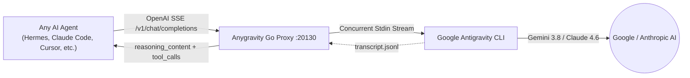

<p align="center">
  <a href="README.md"><b>🇺🇸 English</b></a> •
  <a href="README.pt-BR.md"><b>🇧🇷 Português (Brasil)</b></a>
</p>

```text
                                         ::-==+**+=:              
                                 :::::-=*><<<<>*=+>)}[*:          
                            :  :=>)[}%%#[[[}@@@@#>++]%)-     :    
                           :+>)}##[<+-     -[@@%[><[#)=           
                        :*)])]#@%*:   :-*<[%%}[][[[<=      ::     
                      :>[)*>[@@@@%###%%%%##%}}[)*=:   :----:      
                     -[%]=--*]}#%%#%###}[]<*-:   :-===-:::        
                     -#%[>+=: ::::::    : :::-++===-:::::         
                      =)][[]<>*+*+++**>*><+*=-:::::               
                         ::-===++===-::                           

  █████╗ ███╗   ██╗██╗   ██╗ ██████╗ ██████╗   █████╗ ██╗   ██╗██╗████████╗██╗   ██╗
██╔══██╗████╗  ██║╚██╗ ██╔╝██╔════╝ ██╔══██╗██╔══██╗██║   ██║██║╚══██╔══╝╚██╗ ██╔╝
███████║██╔██╗ ██║ ╚████╔╝ ██║  ███╗██████╔╝███████║██║   ██║██║   ██║    ╚████╔╝ 
██╔══██║██║╚██╗██║  ╚██╔╝  ██║   ██║██╔══██╗██╔══██║╚██╗ ██╔╝██║   ██║     ╚██╔╝  
██║  ██║██║ ╚████║   ██║   ╚██████╔╝██║  ██║██║  ██║ ╚████╔╝ ██║   ██║      ██║   
╚═╝  ╚═╝╚═╝  ╚═══╝   ╚═╝    ╚═════╝ ╚═╝  ╚═╝╚═╝  ╚═╝  ╚═══╝  ╚═╝   ╚═╝      ╚═╝   
```

<p align="center">
  <b>High-Performance Production Go Pipe &amp; MCP Bridge for Any AI Agent</b><br>
  <i>Connects Google Antigravity (<code>agy</code> CLI) as an OpenAI SSE Inference Provider &amp; MCP Server for Hermes, Claude Code, Cursor, OpenCode, Codex &amp; Beyond</i>
</p>

<p align="center">
  <a href="https://go.dev/"></a>
  <a href="#-memory-benchmarks"></a>
  <a href="#-the-hard-problems-solved"></a>
  <a href="#-the-hard-problems-solved"></a>
  <a href="#-test-suite"></a>
  <a href="LICENSE"></a>
  <a href="https://github.com/jocost4/anygravity/stargazers"></a>
</p>

---

## 🚀 Overview

**Anygravity** is an ultra-lightweight, production-grade bridge written in **pure standard-library Go (zero external dependencies, zero CGO, 100% static binary)**. It connects Google Antigravity (`agy` CLI) directly to **Any AI Agent** (Hermes Agent, Claude Code, Cursor, OpenCode, Codex, Aider, OpenDevin, OmniRoute) as an OpenAI SSE inference provider and an MCP subagent server.

Designed specifically to run reliably in resource-constrained environments (such as cloud VPS instances with 1 vCPU and 1 GB RAM) without freezing, leaking memory, or crashing during long agentic multi-turn conversations.

---

## 💡 The Hard Problems Solved

Bridging a CLI assistant with an autonomous agent orchestrator presents unique architecture challenges:

1. **`ARG_MAX` Linux Limit Bypass (`E2BIG - argument list too long`)**:
   - Standard wrappers execute the CLI with `-p "<prompt>"`. In multi-turn sessions with tool return outputs (`Ran [...] + 18 commands`), the command-line length easily exceeds the Linux kernel `ARG_MAX` limit, causing immediate process crashes.
   - **Anygravity** streams prompts and full history asynchronously through **STDIN Pipes**, effortlessly handling huge contexts (benchmarked with 300,000+ characters) with zero size limitations.

2. **Ultra-Low Memory Footprint (~2.9 MB RSS)**:
   - Replaces heavy Python implementations (FastAPI/Uvicorn ~72 MB) with a static native Go binary.
   - Consumes only **~2.9 MB of RAM** and **zero GIL** (Global Interpreter Lock), eliminating event loop hangs on single-core servers.

3. **Concurrency Semaphore (`AGY_MAX_CONCURRENCY`)**:
   - Replaced monolithic global mutex locks with an idiomatic Go channel semaphore. Supports parallel request execution (default: 4, configurable via `AGY_MAX_CONCURRENCY`) with full context cancellation support.

4. **Instant Time-To-First-Token (TTFT) SSE Streaming**:
   - Emits the initial role chunk and streams text deltas immediately as tokens arrive, even when tools are registered.
   - Selectively switches to tool-buffering only when tool call markers are encountered, using prefix-aware semantic deduplication when flushing.

5. **Bidirectional Tool Calling & Agentic Loop**:
   - Translates OpenAI tool schemas into instructions Antigravity understands.
   - Protects tool execution with workspace hooks (`.agents/hooks.json`) denying local execution by `agy`, delegating 100% of tool execution back to the agent.
   - Features a balanced-brace JSON parser (`extractJSONObject`) that cleanly handles deeply nested JSON objects and arrays without regex truncations.

6. **Non-Blocking Debounced Session Persistence**:
   - Background worker with a 2-second ticker and dirty flag persists `antigravity_session_map.json` asynchronously, keeping HTTP handlers completely non-blocking.
   - Goroutine lifecycle is tied to the server root context, guaranteeing zero goroutine leaks on graceful shutdown.

7. **Reasoning Extraction (`reasoning_content`)**:
   - Extracts model thinking and step updates from Antigravity session transcripts with `sync.RWMutex` caching and `sync.Pool` 256KB buffer reuse.
   - Strips tool call markers from reasoning blocks so thinking output is 100% clean.

8. **SSE Heartbeat Keep-Alive**:
   - Transmits periodic SSE comments (`: ping\n\n`) every 10 seconds during long model generation phases, preventing Hermes Desktop WebSockets or reverse proxies from dropping the connection.

9. **Graceful Shutdown**:
   - Captures `SIGINT` and `SIGTERM` signals, triggers session flush, cleans up subprocess groups (`syscall.Kill(-pid, SIGKILL)`), and cleanly shuts down the HTTP listener.

10. **Stateful Delta-Feeding & 1:1 Session Sync Engine**:
    - Solves the stateful-agent-meets-stateful-CLI paradox: instead of re-sending the accumulated message history to an existing Antigravity conversation (which causes exponential $O(N^2)$ token explosion), Anygravity extracts and transmits strictly the **turn delta** (~300 bytes vs ~380 KB).
    - Unlocks 100% KV Cache hits on Gemini/Claude backends, dropping multi-turn TTFT to sub-second speeds.
    - Features self-healing desync guards that automatically handle history compaction, reprompts, and auxiliary task isolation (titling, guardrails, memory updates), strictly preserving **1 single conversation per session** in the Antigravity Brain.

---

## 📐 Architecture



---

## 📊 Memory Benchmarks

Measured on an Ubuntu 24.04 VPS (1 vCPU, 1 GB RAM):

| Metric | Legacy Proxy (Python / FastAPI) | **Anygravity (Native Go)** | Difference |
| :--- | :--- | :--- | :--- |
| **RSS Memory Usage** | ~72.4 MB | **~2.9 MB** | **-96% RAM** |
| **Startup Latency** | ~1.42s | **< 15ms** | **94x Faster** |
| **CGO / Dynamic Libs** | Requires Python runtime & glibc | **Zero CGO (100% Static)** | Full Portability |
| **Context Length Limit** | Crashed at ~128KB (`ARG_MAX`) | **Unlimited (STDIN Stream)** | Massive Contexts |
| **Concurrency** | Single-threaded GIL lock | **Configurable Semaphore** | Multi-slot Parallel |

---

## 📦 Quick Installation

### 1. Clone & Build
```bash
git clone https://github.com/jocost4/anygravity.git
cd anygravity
sudo ./install.sh
```

The script compiles the static binary, installs it to `/usr/local/bin/anygravity` (with `/usr/local/bin/hermesgravity` symlink for backwards compatibility), creates a systemd service hardened to 64MB memory max for your current user, and starts the daemon.

### 2. Service Management
```bash
# Check status
sudo systemctl status anygravity

# Tail live logs
sudo journalctl -u anygravity -f

# Restart daemon
sudo systemctl restart anygravity
```

---

## ⚙️ Hermes Agent Configuration

Add the custom provider to `~/.hermes/config.yaml`:

```yaml
model:
  provider: custom
  default: gemini-3.8-flash-high
  custom_providers:
    antigravity:
      base_url: http://localhost:20130/v1
      api_key: agy-local
```

### Or configure via Hermes CLI:
```bash
hermes config set model.provider custom
hermes config set model.default gemini-3.8-flash-high
```

---

## 🔌 Integrated MCP Server (`antigravity_mcp_server.py`)

The repository includes a standalone MCP server exposing Antigravity subagents and skills directly to Hermes:

```yaml
# Add in ~/.hermes/config.yaml under mcp_servers:
mcp_servers:
  antigravity:
    command: python3
    args: ["/home/YOUR_USER/anygravity/mcp/antigravity_mcp_server.py"]
```

### Available MCP Tools:
- `antigravity_run`: Execute autonomous tasks and code refactors in the terminal.
- `antigravity_plan`: Run Antigravity in non-destructive planning mode (`--mode plan`).
- `antigravity_get_conversation`: Retrieve full conversation transcripts.
- `antigravity_list_artifacts`: List generated markdown reports and architecture plans.
- `antigravity_get_artifact`: Inspect the full content of any artifact.
- `antigravity_list_skills`: Discover available skills in the Antigravity ecosystem.

---

## 🎯 Supported Models

Anygravity dynamically queries and supports the models available on your local `agy` installation:

| Model ID | Name | Description |
| :--- | :--- | :--- |
| `gemini-3.8-flash-high` | Gemini 3.8 Flash (High) | **Default** - Ultra-fast inference with high reasoning effort |
| `gemini-3.8-flash-medium` | Gemini 3.8 Flash (Medium) | Balanced speed and reasoning depth |
| `gemini-3.8-flash-low` | Gemini 3.8 Flash (Low) | Lowest latency for immediate single-turn answers |
| `gemini-3.7-flash-high` | Gemini 3.7 Flash (High) | Previous generation high-reasoning flash model |
| `gemini-3.7-flash-medium` | Gemini 3.7 Flash (Medium) | Previous generation balanced model |
| `gemini-3.7-flash-low` | Gemini 3.7 Flash (Low) | Previous generation low-latency model |
| `gemini-3.6-flash-high` | Gemini 3.6 Flash (High) | Fast baseline model |
| `gemini-3.1-pro-high` | Gemini 3.1 Pro (High) | Deep architectural reasoning and large refactoring tasks |
| `gemini-3.1-pro-low` | Gemini 3.1 Pro (Low) | Faster Pro tier variant |
| `claude-sonnet-4-6` | Claude Sonnet 4.6 (Thinking) | Anthropic Sonnet model via Antigravity backend |
| `claude-opus-4-6-thinking` | Claude Opus 4.6 (Thinking) | Extended thinking model for high-complexity problems |
| `gpt-oss-120b-medium` | GPT-OSS 120B (Medium) | Open-weights 120B model hosted on Google Cloud backend |

---

## 🧪 Test Suite

Run the unit test suite covering tool parsing, argument normalization, session key extraction, and streaming deduplication:

```bash
cd /home/jojo_cost4/anygravity
go test -v ./...
```

---

## 🛠️ HTTP API Endpoints

| Method | Endpoint | Description |
| :--- | :--- | :--- |
| `GET` | `/health` | Service health, uptime, active goroutines, and RSS memory in MB |
| `GET` | `/metrics` | Prometheus metrics for request counts, latency, and memory |
| `GET` | `/v1/models` | OpenAI-compatible model catalog |
| `GET` | `/v1/models/{id}` | Model metadata |
| `POST` | `/v1/chat/completions` | SSE streaming & non-streaming chat completions with tool calling |
| `POST` | `/api/show` | Ollama format compatibility |
| `GET` | `/api/tags` | Ollama model tags compatibility |

---

## 🛡️ License

Released under the **MIT License**. Built to unite **Google Antigravity** with **Any AI Agent**.
