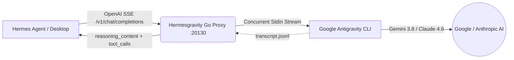

<p align="center">
  <a href="README.md"><b>🇺🇸 English</b></a> •
  <a href="README.pt-BR.md"><b>🇧🇷 Português (Brasil)</b></a>
</p>

```text
                                                    ::-==+**+=:              
                                            :::::-=*><<<<>*=+>)}[*:          
                                       :  :=>)[}%%#[[[}@@@@#>++]%)-     :    
                                      :+>)}##[<+-     -[@@%[><[#)=           
                                   :*)])]#@%*:   :-*<[%%}[][[[<=      ::     
                                 :>[)*>[@@@@%###%%%%##%}}[)*=:   :----:      
                                -[%]=--*]}#%%#%###}[]<*-:   :-===-:::        
                                -#%[>+=: ::::::    : :::-++===-:::::         
                                 =)][[]<>*+*+++**>*><+*=-:::::               
                                    ::-===++===-::                           

██╗  ██╗███████╗██████╗ ███╗   ███╗███████╗███████╗ ██████╗ ██████╗  █████╗ ██╗   ██╗██╗████████╗██╗   ██╗
██║  ██║██╔════╝██╔══██╗████╗ ████║██╔════╝██╔════╝██╔════╝ ██╔══██╗██╔══██╗██║   ██║██║╚══██╔══╝╚██╗ ██╔╝
███████║█████╗  ██████╔╝██╔████╔██║█████╗  ███████╗██║  ███╗██████╔╝███████║██║   ██║██║   ██║    ╚████╔╝ 
██╔══██║██╔══╝  ██╔══██╗██║╚██╔╝██║██╔══╝  ╚════██║██║   ██║██╔══██╗██╔══██║╚██╗ ██╔╝██║   ██║     ╚██╔╝  
██║  ██║███████╗██║  ██║██║ ╚═╝ ██║███████╗███████║╚██████╔╝██║  ██║██║  ██║ ╚████╔╝ ██║   ██║      ██║   
╚═╝  ╚═╝╚══════╝╚═╝  ╚═╝╚═╝     ╚═╝╚══════╝╚══════╝ ╚═════╝ ╚═╝  ╚═╝╚═╝  ╚═╝  ╚═══╝  ╚═╝   ╚═╝      ╚═╝ 
```

<p align="center">
  <b>Pipe Go de Alta Performance &amp; Ponte MCP para o Hermes Agent</b><br>
  <i>Conecta o Google Antigravity (CLI <code>agy</code>) diretamente como Provider OpenAI SSE &amp; Servidor MCP</i>
</p>

<p align="center">
  <a href="https://go.dev/"></a>
  <a href="#-benchmarks-de-memória"></a>
  <a href="#-problemas-críticos-resolvidos"></a>
  <a href="#-problemas-críticos-resolvidos"></a>
  <a href="#-suite-de-testes"></a>
  <a href="LICENSE"></a>
  <a href="https://github.com/jocost4/hermesgravity/stargazers"></a>
</p>

---

## 🚀 O que é o Hermesgravity?

O **Hermesgravity** é um proxy/pipe de altíssima performance e nível de produção, escrito em **Go puro (sem dependências externas, sem CGO e com binário 100% estático)**, projetado para transformar o Google Antigravity (`agy` CLI) em um provedor de inferência OpenAI SSE e um servidor MCP para o **Hermes Agent**.

Criado para operar com estabilidade absoluta em ambientes com poucos recursos (como VPS de 1 vCPU e 1 GB de RAM), garantindo zero congelamentos, zero vazamento de memória e suporte a conversas multi-turn complexas com chamada de ferramentas.

---

## 💡 Problemas Críticos Resolvidos

1. **Bypass de `ARG_MAX` (`E2BIG - argument list too long`)**:
   - Proxies comuns disparam o executável com `-p "<prompt>"`. Após algumas rodadas de conversa com retornos de ferramentas (`Ran [...] + 18 commands`), o tamanho dos argumentos excede o limite do kernel Linux (`ARG_MAX`), travando a execução.
   - O **Hermesgravity** transmite todo o histórico e instruções via **STDIN Pipe assíncrono**, suportando prompts gigantescos (testado com mais de 300.000 caracteres) sem limite de tamanho.

2. **Pegada de Memória Ridiculamente Baixa (~2.9 MB RSS)**:
   - Substitui implementações pesadas em Python (FastAPI/Uvicorn ~72 MB) por um binário nativo Go estático.
   - Consome apenas **~2.9 MB de RAM** e **zero GIL** (Global Interpreter Lock), eliminando travamentos de event loop em processadores de núcleo único.

3. **Semáforo de Concorrência (`AGY_MAX_CONCURRENCY`)**:
   - Substituiu locks globais monolíticos por um semáforo idiomático de canal Go. Suporta até 4 requisições simultâneas por padrão (configurável via `AGY_MAX_CONCURRENCY`) com suporte a cancelamento limpo por contexto HTTP.

4. **Streaming SSE com TTFT Instantâneo**:
   - Emite o chunk inicial de `role: assistant` e transmite deltas de texto em tempo real assim que os tokens chegam, mesmo quando ferramentas estão ativas.
   - Ativa bufferização seletiva apenas quando marcadores de ferramentas são encontrados, utilizando deduplicação semântica por prefixo no flush.

5. **Tool Calling Bidirecional e Ciclo de Agentificação**:
   - Mapeia schemas de ferramentas do formato OpenAI (`tools`) para instruções interpretáveis pelo Antigravity.
   - Protege a execução local via workspace hooks (`.agents/hooks.json`) que negam a execução local no `agy`, delegando 100% da execução das ferramentas de volta ao Hermes.
   - Inclui parser de chaves balanceadas (`extractJSONObject`) imune a quebras de regex em objetos e arrays JSON aninhados.

6. **Persistência de Sessões Assíncrona e Debounced**:
   - Worker em segundo plano com ticker de 2 segundos e dirty flag salva o `antigravity_session_map.json` de forma assíncrona, mantendo os handlers HTTP totalmente não-bloqueantes.
   - Ciclo de vida da goroutine atrelado ao `rootCtx` do servidor, garantindo zero vazamento de goroutines no shutdown.

7. **Extração Nativa de Raciocínio (`reasoning_content`)**:
   - Captura pensamentos internos e passos dos transcripts do Antigravity com cache thread-safe (`sync.RWMutex`) e reaproveitamento de buffers de 256KB (`sync.Pool`).
   - Remove marcadores de tool calls dos blocos de pensamento, garantindo que o `reasoning_content` entregue apenas a linha de raciocínio limpa.

8. **SSE Heartbeat Keep-Alive**:
   - Envia comentários SSE periódicos (`: ping\n\n`) a cada 10 segundos de silêncio do modelo, impedindo que o WebSocket do Hermes Desktop ou gateways encerrem a conexão por timeout.

9. **Graceful Shutdown**:
   - Captura sinais `SIGINT` e `SIGTERM`, faz o flush atômico do mapa de sessões, encerra grupos de subprocessos (`syscall.Kill(-pid, SIGKILL)`) e desliga o servidor HTTP de forma limpa.

10. **Stateful Delta-Feeding & Sincronização 1:1 de Sessões**:
    - Resolve o paradoxo entre o agente cumulativo (Hermes) e a CLI persistente (Antigravity): em vez de re-enviar todo o histórico acumulado (o que causava explosão exponencial $O(N^2)$ de tokens), o Hermesgravity extrai e transmite estritamente o **delta do turno** (~300 bytes contra ~380 KB).
    - Habilita 100% de reaproveitamento de KV Cache nos backends Gemini/Claude, despencando o TTFT multi-turno para centenas de milissegundos.
    - Possui salvaguardas de auto-cura contra desync que tratam podas/compactações de contexto, reprompts e isolamento de tarefas efêmeras (títulos, guardrails, reflexão de memória), mantendo **estritamente 1 única conversa por sessão** no Brain do Antigravity.

---

## 📐 Arquitetura



---

## 📊 Benchmarks de Memória

Testado em VPS Ubuntu 24.04 (1 vCPU, 1 GB RAM):

| Métrica | Proxy Legado (Python / FastAPI) | **Hermesgravity (Go Nativo)** | Diferença |
| :--- | :--- | :--- | :--- |
| **Uso de Memória RSS** | ~72.4 MB | **~2.9 MB** | **-96% de RAM** |
| **Tempo de Inicialização** | ~1.42s | **< 15ms** | **94x mais rápido** |
| **CGO / Dependências C** | Exige Python & glibc | **Zero CGO (100% Estático)** | Portabilidade total |
| **Limite de Contexto** | Quebrava em ~128KB (`ARG_MAX`) | **Ilimitado (Streaming STDIN)** | Suporta contextos gigantes |
| **Concorrência** | Monothread bloqueante | **Semáforo Multi-Slot** | Paralelismo real |

---

## 📦 Instalação Rápida

### 1. Clonar e Compilar
```bash
git clone https://github.com/jocost4/hermesgravity.git
cd hermesgravity
sudo ./install.sh
```

O instalador compila o binário estático, instala em `/usr/local/bin/hermesgravity`, cria o serviço systemd configurado para o seu usuário local com limite de 64MB de RAM e inicia o daemon.

### 2. Comandos do Serviço Systemd
```bash
# Ver status em tempo real
sudo systemctl status hermesgravity

# Acompanhar logs
sudo journalctl -u hermesgravity -f

# Reiniciar serviço
sudo systemctl restart hermesgravity
```

---

## ⚙️ Configuração no Hermes Agent

Edite seu arquivo `~/.hermes/config.yaml`:

```yaml
model:
  provider: custom
  default: gemini-3.8-flash-high
  custom_providers:
    antigravity:
      base_url: http://localhost:20130/v1
      api_key: agy-local
```

### Configurar via CLI do Hermes:
```bash
hermes config set model.provider custom
hermes config set model.default gemini-3.8-flash-high
```

---

## 🔌 Servidor MCP Integrado (`antigravity_mcp_server.py`)

O repositório inclui um servidor MCP nativo para expor as capacidades completas do Antigravity como ferramentas para o Hermes Agent:

```yaml
# Adicione em ~/.hermes/config.yaml sob mcp_servers:
mcp_servers:
  antigravity:
    command: python3
    args: ["/home/seu-usuario/hermesgravity/mcp/antigravity_mcp_server.py"]
```

### Ferramentas MCP Disponíveis:
- `antigravity_run`: Executa refatores e tarefas autônomas no terminal com aprovação automática.
- `antigravity_plan`: Executa o Antigravity em modo de planejamento (`--mode plan`).
- `antigravity_get_conversation`: Resgata histórico de conversas do Antigravity.
- `antigravity_list_artifacts`: Lista planos e relatórios `.md` gerados pelo Antigravity.
- `antigravity_get_artifact`: Lê o conteúdo completo de um artefato específico.
- `antigravity_list_skills`: Descobre skills instaladas no ecossistema Antigravity.

---

## 🎯 Modelos Suportados

O Hermesgravity consulta e suporta os modelos da sua instalação local do `agy`:

| Model ID | Nome | Descrição |
| :--- | :--- | :--- |
| `gemini-3.8-flash-high` | Gemini 3.8 Flash (High) | **Padrão** - Alta velocidade com esforço elevado de raciocínio |
| `gemini-3.8-flash-medium` | Gemini 3.8 Flash (Medium) | Equilíbrio entre velocidade e profundidade |
| `gemini-3.8-flash-low` | Gemini 3.8 Flash (Low) | Menor latência para respostas rápidas |
| `gemini-3.7-flash-high` | Gemini 3.7 Flash (High) | Geração anterior com alto raciocínio |
| `gemini-3.7-flash-medium` | Gemini 3.7 Flash (Medium) | Geração anterior balanceada |
| `gemini-3.7-flash-low` | Gemini 3.7 Flash (Low) | Geração anterior de baixa latência |
| `gemini-3.6-flash-high` | Gemini 3.6 Flash (High) | Modelo base rápido |
| `gemini-3.1-pro-high` | Gemini 3.1 Pro (High) | Tarefas profundas de arquitetura e grandes refatores |
| `gemini-3.1-pro-low` | Gemini 3.1 Pro (Low) | Variante mais rápida do Pro |
| `claude-sonnet-4-6` | Claude Sonnet 4.6 (Thinking) | Modelo Anthropic Sonnet via backend Antigravity |
| `claude-opus-4-6-thinking` | Claude Opus 4.6 (Thinking) | Raciocínio estendido para problemas de alta complexidade |
| `gpt-oss-120b-medium` | GPT-OSS 120B (Medium) | Modelo open-weights 120B hospedado no backend Google |

---

## 🧪 Suite de Testes

Execute a suite de testes unitários que cobre parsing de ferramentas, normalização de argumentos, hash de sessão e deduplicação de streaming:

```bash
cd /home/jojo_cost4/hermesgravity
go test -v ./...
```

---

## 🛠️ Endpoints Disponíveis

| Método | Endpoint | Descrição |
| :--- | :--- | :--- |
| `GET` | `/health` | Status do serviço, uptime, rotinas ativas e uso de RAM em MB |
| `GET` | `/metrics` | Métricas Prometheus de requisições e memória |
| `GET` | `/v1/models` | Lista de modelos compatível com OpenAI |
| `GET` | `/v1/models/{id}` | Metadados do modelo |
| `POST` | `/v1/chat/completions` | Streaming (SSE) e Non-Streaming chat completions com tool calling |
| `POST` | `/api/show` | Compatibilidade com Ollama |
| `GET` | `/api/tags` | Compatibilidade com Ollama |

---

## 🛡️ Licença

Distribuído sob a licença MIT. Criado para a comunidade open-source unindo o ecossistema **Hermes Agent** e **Google Antigravity**.
