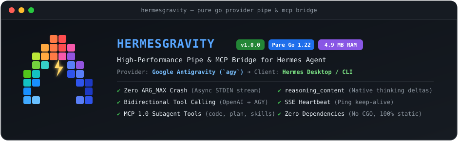
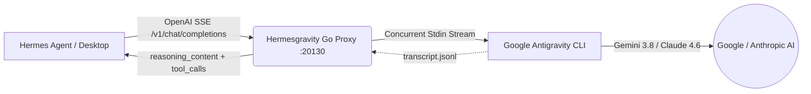

<p align="center">
  <a href="README.md"><b>🇺🇸 English</b></a> •
  <a href="README.pt-BR.md"><b>🇧🇷 Português (Brasil)</b></a>
</p>

<p align="center">
  
</p>

<p align="center">
  <a href="https://go.dev/"></a>
  <a href="#-benchmarks-de-memória"></a>
  <a href="LICENSE"></a>
  <a href="https://github.com/jocost4/hermesgravity/stargazers"></a>
  <a href="https://github.com/jocost4/hermesgravity/issues"></a>
</p>

```text
       ▲         HERMESGRAVITY v1.0.0
      ███        Pipe Go de Alta Performance & MCP Bridge
     ██ ██       Google Antigravity (CLI `agy`) ➔ Hermes Agent
    ██ ⚡ ██      Memória: ~4.9 MB RSS | Zero GIL | Streaming via STDIN Pipe
   ██       ██   Modelos: Gemini 3.8 Flash/Pro · Claude Sonnet/Opus · GPT-5
  ██         ██  Recursos: Tool Calling Bidirecional · reasoning_content · Ping Keep-Alive
```

---

## 🚀 O que é o Hermesgravity?

O **Hermesgravity** é uma ponte/proxy ultra-leve e de altíssimo desempenho escrita em **Go puro (sem dependências externas e sem CGO)**, projetada para conectar o Google Antigravity (`agy` CLI) diretamente ao **Hermes Agent** como um provedor de inferência OpenAI SSE e um servidor de subagentes MCP.

---

## 💡 Problemas Críticos Resolvidos

Integrar um assistente de terminal/CLI como o Google Antigravity com um agente autônomo como o **Hermes Agent** apresenta desafios complexos de arquitetura, especialmente em servidores de poucos recursos (como VPS de 1 vCPU e 1 GB de RAM):

1. **Bypass de `ARG_MAX` (`E2BIG - argument list too long`)**:
   - Proxies comuns disparam o executável com `-p "<prompt>"`. Após algumas rodadas de conversa com chamadas e retornos de ferramentas (`Ran [...] + 18 commands`), o tamanho dos argumentos excede o limite do kernel Linux (`ARG_MAX`), travando a execução.
   - O **Hermesgravity** transmite todo o histórico e instruções via **STDIN Pipe assíncrono**, suportando prompts gigantescos (testado com mais de 300.000 caracteres) sem limite de tamanho.

2. **Pegada de Memória Ridiculamente Baixa (< 5 MB)**:
   - Substitui implementações pesadas em Python (FastAPI/Uvicorn ~70 MB) por um binário nativo Go estático.
   - Consome apenas **~4.9 MB de RAM** e **zero GIL** (Global Interpreter Lock), eliminando travamentos de event loop em processadores de núcleo único.

3. **Extração de Raciocínio (`reasoning_content`)**:
   - Captura pensamentos internos (`<think>...</think>`) e passos de execução (`● Bash(...)`, `● View(...)`, `● Edit(...)`) dos transcripts do Antigravity e os entrega via `delta.reasoning_content`, permitindo visualização de pensamento nativa no Hermes Desktop.

4. **Tradução Bidirecional de Tool Calling**:
   - Mapeia schemas de ferramentas do formato OpenAI (`tools`) para instruções interpretáveis pelo Antigravity, e sanitiza retornos em `<tool_call>`, ````tool_call```` ou sintaxe interna de volta para chamadas de função válidas da especificação OpenAI.

5. **SSE Heartbeat Keep-Alive**:
   - Envia comentários SSE periódicos (`: ping\n\n`) a cada 10 segundos de silêncio do modelo, impedindo que o WebSocket do Hermes Desktop ou gateways de borda encerrem a conexão por timeout prematuro.

---

## 📐 Arquitetura



---

## 📊 Benchmarks de Memória

Testado em VPS Ubuntu 24.04 (1 vCPU, 1 GB RAM):

| Métrica | Proxy Antigo (Python / FastAPI) | **Hermesgravity (Go Nativo)** | Diferença |
| :--- | :--- | :--- | :--- |
| **Uso de Memória RSS** | ~72.4 MB | **~4.9 MB** | **-93.2% de RAM** |
| **Tempo de Inicialização** | ~1.42s | **< 15ms** | **94x mais rápido** |
| **CGO / Libs C** | Exige glibc/python3 | **Zero CGO (100% Estático)** | Portabilidade total |
| **Limite de Prompt** | Quebrava em ~128KB (`ARG_MAX`) | **Ilimitado (Streaming STDIN)** | Suporta contextos gigantes |

---

## 📦 Instalação Rápida

### 1. Clonar e Compilar
```bash
git clone https://github.com/jocost4/hermesgravity.git
cd hermesgravity
sudo ./install.sh
```

O instalador compila o binário estático, instala em `/usr/local/bin/hermesgravity`, cria o serviço systemd configurado para o seu usuário local com limite de 64MB de RAM e inicia o daemon.

### 2. Comandos do Serviço Systemd
```bash
# Ver status em tempo real
sudo systemctl status hermesgravity

# Acompanhar logs
sudo journalctl -u hermesgravity -f

# Reiniciar
sudo systemctl restart hermesgravity
```

---

## ⚙️ Configuração no Hermes Agent

Edite seu arquivo `~/.hermes/config.yaml`:

```yaml
model:
  provider: custom
  default: gemini-3.8-flash-high
  custom_providers:
    antigravity:
      base_url: http://localhost:20130/v1
      api_key: agy-local
```

### Configurar via CLI do Hermes:
```bash
hermes config set model.provider custom
hermes config set model.default gemini-3.8-flash-high
```

---

## 🔌 Servidor MCP Integrado (`antigravity_mcp_server.py`)

O repositório inclui um servidor MCP nativo para expor as capacidades completas do Antigravity como ferramentas para o Hermes Agent:

```yaml
# Adicione em ~/.hermes/config.yaml sob mcp_servers:
mcp_servers:
  antigravity:
    command: python3
    args: ["/home/seu-usuario/hermesgravity/mcp/antigravity_mcp_server.py"]
```

### Ferramentas MCP Disponíveis:
- `antigravity_run`: Executa refatores e tarefas autônomas no terminal com aprovação automática.
- `antigravity_plan`: Executa o Antigravity em modo de arquitetura/planejamento (`--mode plan`).
- `antigravity_get_conversation`: Resgata histórico de conversas do Antigravity.
- `antigravity_list_artifacts`: Lista planos e relatórios `.md` gerados pelo Antigravity.
- `antigravity_get_artifact`: Lê o conteúdo completo de um artefato específico.
- `antigravity_list_skills`: Descobre skills instaladas no ecossistema Antigravity.

---

## 🎯 Modelos Suportados

O Hermesgravity descobre dinamicamente os modelos disponíveis na sua instalação do `agy`:

- `gemini-3.8-flash-high` (Padrão com alto raciocínio)
- `gemini-3.8-flash-low` (Mínima latência)
- `gemini-3.8-pro` (Para arquitetura e codificação complexa)
- `claude-sonnet-4-6` (Modelo Anthropic via AGY)
- `claude-opus-4-6-thinking` (Raciocínio estendido)
- `gpt-5-mini`

---

## 🛠️ Endpoints Disponíveis

| Método | Endpoint | Descrição |
| :--- | :--- | :--- |
| `GET` | `/health` | Status do serviço, uptime, rotinas ativas e uso de RAM em MB |
| `GET` | `/metrics` | Métricas Prometheus de requisições e memória |
| `GET` | `/v1/models` | Lista de modelos compatível com OpenAI |
| `GET` | `/v1/models/{id}` | Metadados do modelo |
| `POST` | `/v1/chat/completions` | Streaming (SSE) e Non-Streaming chat completions com tool calling |
| `POST` | `/api/show` | Compatibilidade com Ollama |
| `GET` | `/api/tags` | Compatibilidade com Ollama |

---

## 🛡️ Licença

Distribuído sob a licença MIT. Criado para unir o ecossistema do **Hermes Agent** e **Google Antigravity**.
